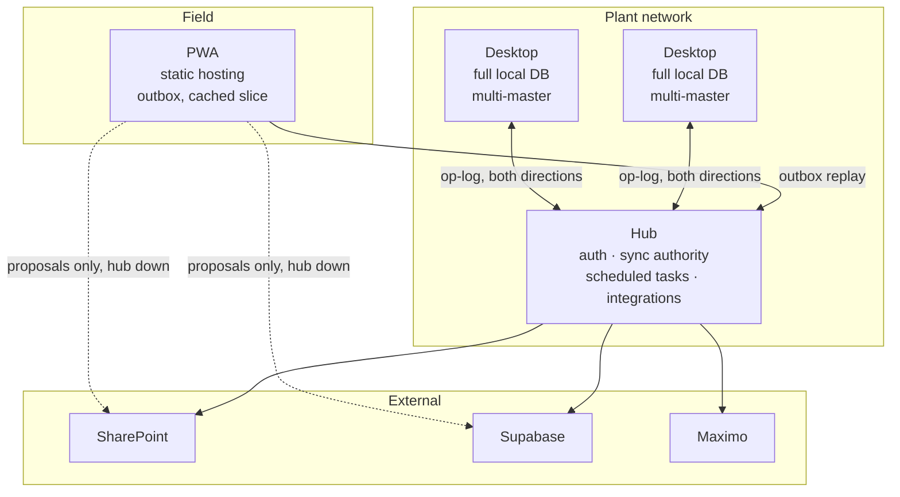

# System Overview

The shape of the rebuilt system, as far as it has been decided. Anything not settled
is in [[open-questions]] rather than guessed at here.

## Deployables



Solid lines are the normal path. Dotted lines are degraded-mode transports that may
carry **only append-only proposals**, per
[[../decisions/0006-pwa-direct-writes-are-proposals]].

## The four roles

| Deployable | Holds | Offline behaviour |
|---|---|---|
| **Hub** | The authoritative op-log; owns identity assignment and integration with external systems | n/a |
| **Desktop** | A complete local database and its own op-log segment | Fully operational, indefinitely. Converges on reconnect |
| **PWA** | A cached read slice and a local outbox | Reads cached data, queues writes, replays on reconnect |
| **Electron shell** | No domain data | Hosts the desktop app; manages windows, updates, and sub-applications |

## Replication in one paragraph

Every change is an entry in an append-only **op-log**, written in the same
transaction as the data it describes — never inferred from ORM lifecycle callbacks.
Each entry carries a **hybrid logical clock** stamp and its originating node id.
Nodes exchange log segments; each applies entries it has not seen. How a field
resolves when two entries touch it concurrently is **declared on the field**, not
coded per entity — last-writer-wins, set union, or escalation to a human. Same-field
collisions that cannot merge are surfaced as conflicts rather than silently resolved.

The governing decisions: [[../decisions/0004-three-deployables-multi-master]],
[[../decisions/0007-sync-built-in-house]],
[[../decisions/0009-hybrid-logical-clocks]],
[[../decisions/0008-two-sync-mechanisms]].

## Code organisation

One workspace, per [[../decisions/0005-monorepo-generated-contracts]]:

```
packages/contracts    generated from backend OpenAPI — never hand-edited
packages/api-client   typed client over contracts
packages/core         auth, outbox, storage, clock
packages/ui           shared Angular components
apps/desktop  apps/pwa  apps/electron-shell
```

The backend is the system of record for wire contracts; the TypeScript types are
generated from it, so client and server cannot silently disagree.

## What is deliberately unchanged from the current system

- Three deployables, and desktop autonomy. Both were challenged and both survived on
  the evidence — see [[../decisions/0004-three-deployables-multi-master]].
- SharePoint, Supabase, and Maximo remain integration targets.
- The PWA remains statically hosted and independently deployable.

## What changes

| | Current | New |
|---|---|---|
| Change capture | inferred from JPA `@PostUpdate` | explicit op-log, same transaction |
| Ordering | wall-clock `Instant` | hybrid logical clock |
| Merge rules | coded per entity | declared per field |
| Same-field conflict | silent last-writer-wins | surfaced |
| PWA sync | shares the desktop mechanism | outbox only |
| Wire types | hand-written in TypeScript | generated from Java |
| Schema | Hibernate auto-DDL | versioned migrations *(tool undecided)* |
| Shared frontend code | none — 36 identical file pairs | shared packages |
